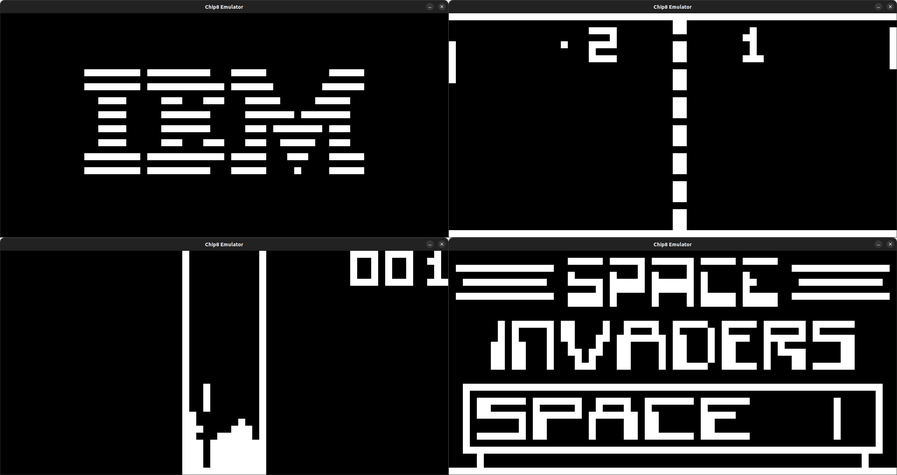

# CHIP-8 Emulator
A CHIP-8 emulator written in C++, using SDL2 for graphics.




## How to build
Make sure you have SDL2 installed: [Installation guide](https://wiki.libsdl.org/Installation).

Then you should be able to build by running:
```bash
mkdir build && cd build
cmake ..
make
./chip8 <path_to_ROM>
```

## How to play
The keypad layout is mapped to the keyboard as:
```
(Chip8 keypad)          (Keyboard mapping)
1 | 2 | 3 | C            1 | 2 | 3 | 4
4 | 5 | 6 | D     =>     Q | W | E | R
7 | 8 | 9 | E            A | S | D | F
A | 0 | B | F            Z | X | C | V
```
You can download roms from this link: [kripod/chip8-roms: ROMs for CHIP-8.](https://github.com/kripod/chip8-roms)

## Running tests
The tests are written using GoogleTest. Since they operate on private members of the CPU class, you'll need to manually change their access modifier from private to public before compiling (in cpu.h).

Once you've done that, you can simply run:
```bash
cmake .. -DBUILD_TESTS
make all
```

## TODO
- [ ] Sound support
- [ ] Fullscreen mode
- [ ] Improve timing
- [ ] Super-Chip support
- [ ] Custom keybindings

## License
This project is open source and available under the [MIT License](LICENSE).